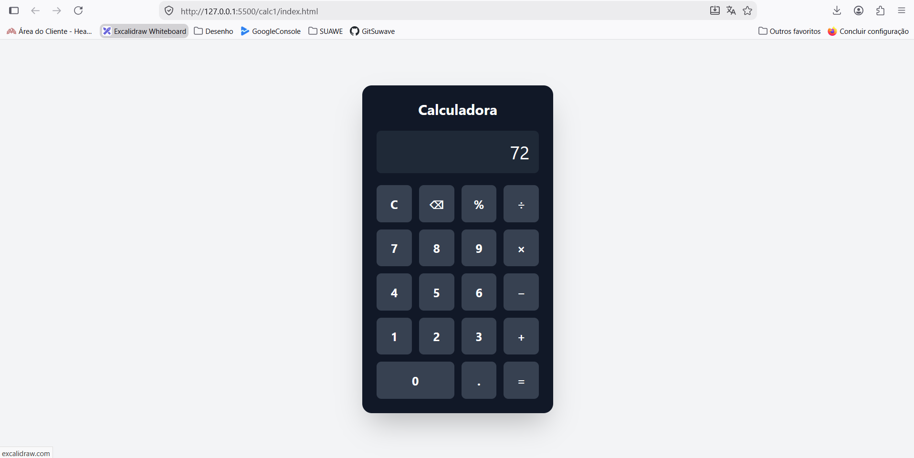

### Projeto calculadora HTML



## 1. Primeira vez comando para salvar no git Estar dentro do diretório.

### 1.1 Git
```
git init
```

### 1.2 Adicionar tudo dentro do commit ou area de Stage
```
git add .
```

### 2. Criar o projeto no github e copiar

```
git commit -m "first commit"
git branch -M main
git remote add origin https://github.com/rgleison17-pixel/calculadora.git
git push -u origin main
```

## Projeto já existe só salvar alterações

### 1. Adicionar tudo da area de Stage
```
git add .
```

### 2. Nome para as alterações
```
git commit -m "Atualizando meu repo de calculadora
```

### 3. Envia para o github
```
git puth
```